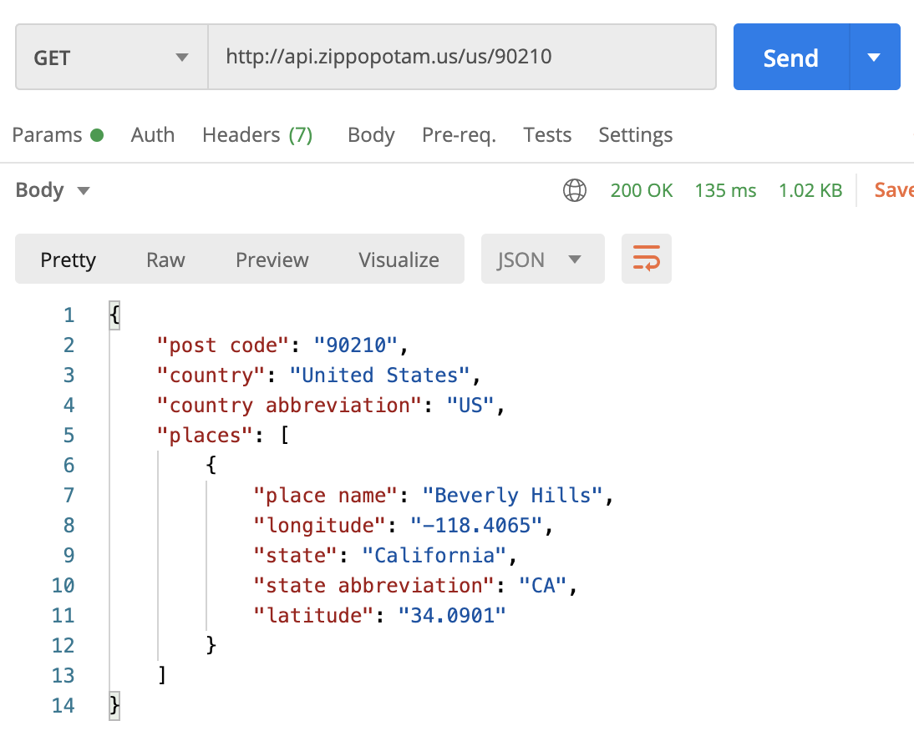
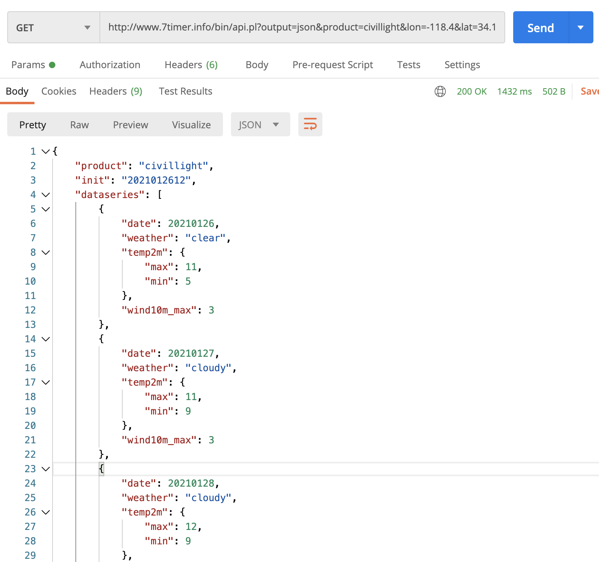
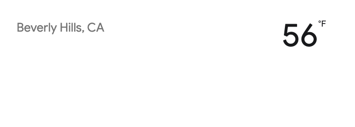
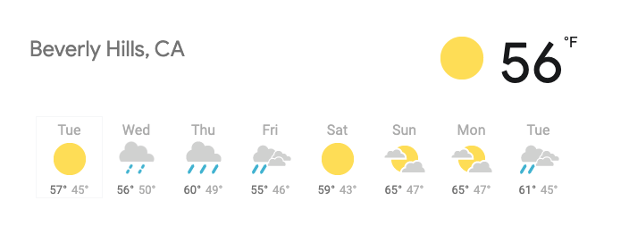

# Weather App

You will be creating an app to get the weather!

## Requirements

### Part 1
Use a prompt to get the user's zip code. Use the `Zippopotamus` API to get the zip code's state and city. 

For example, you would provide `Zippopotamus` with the data `90210` to get data for Beverly Hills. You can see the service provides you with the name of the state and city. 

You should display the state and city data on the webpage like this:

### Part 2
Use the `longitude` and `latitude` you get from `Zippopotamus` to get weather data from the `7Timer` API. 

For example, with the data `-118.4` and `34.1` as longitude and latitude respectively, `7Timer` will provide all the weather data for Beverly Hills.

Use the weather information to display the current temperature like this:

### Part 3
Use all the weather data you recieve from `7Timer` to generate a 7 day forcast for the given zip code. 

### Part 4
Have the browser collect the user's zip code from their location so that they do not have to enter it.

## Submission
Push your code to GitHub and create a Pull Request

**Happy Hacking**
